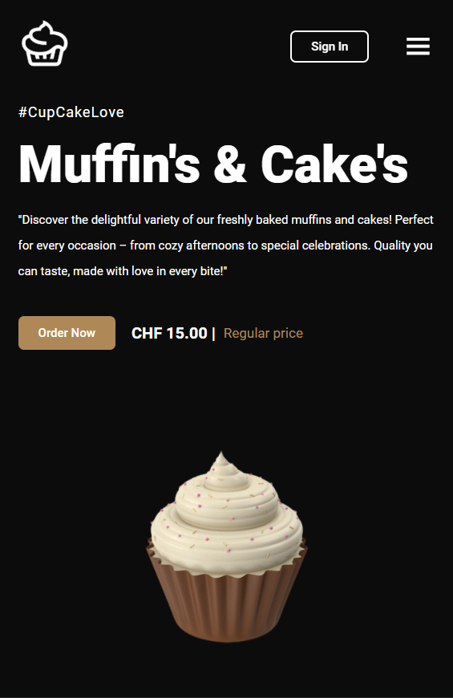

# Cake and Cupcake Website (responsive)

This is a small website I created as a practice exercise using HTML, CSS, and JavaScript. The website is focused on cakes and cupcakes, and I made it specifically for my mother.
It is also **responsive**, meaning it adapts to different screen sizes.

<p><b>Desktop Preview:


<p>    


<p><b>Mobile Preview:

       


<p><b>Demo/ Preview of the Website:


https://github.com/user-attachments/assets/e485b987-2ca4-4eeb-8116-ee53f03a1a99
## Status

The website is still a work in progress. I created it as an exercise, and there is still a lot to improve or add. <p>
It is not a finished, published website yet.

## Technologies

- HTML
- CSS
- JavaScript

## Installation

1. Clone the repository:

  ```bash
   git clone https://github.com//venu21-dev/Cake_Website/.git
